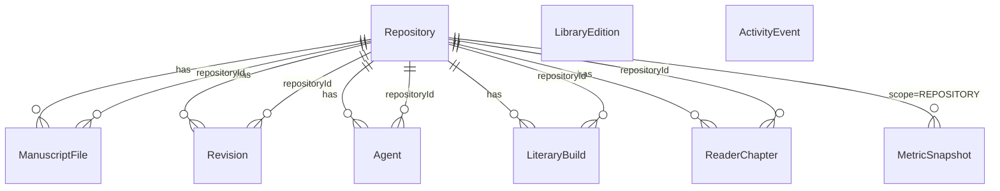

# Domain model (GraphQL)

GraphQL SDL at the monorepo root documenting the **Gittenberg** domain for Textus. This folder is the human- and tool-readable contract for APIs and integrations; runtime types and validation live in **`@tx/domain-shared`** (Effect Schema).

## Relationship to other packages

| Package | Role |
|---------|------|
| `@tx/core-domain` | Generic `EntityId`, `PaginationInput`, `Page`, `CrudPort` |
| `@tx/domain-shared` | Nine entity classes + create/update inputs + port interfaces |
| `@tx/gittenberg-data` | Seed data (`gittenberg-seed.ts`), `GittenbergPorts`, backends |
| `@tx/gittenberg-data-react` | `GittenbergSnapshot` loader + TanStack Query |
| `@tx/ui-lib` | Presentation mappers; JSON shapes in `gittenberg-json.ts` |

## Schema layout

All modules live under [`graphql/`](graphql/). Files are merged in **lexicographic order** (numeric prefixes). Entry pointer: [`graphql/schema.graphql`](graphql/schema.graphql).

```bash
# From repo root, after bun install (links tx-admin via cli-admin postinstall)
tx-admin domain validate-schema
```

## Entity model (9 CRUD entities)



### Repository (aggregate root)

| Field | Type | Seed example |
|-------|------|----------------|
| `slug` | String | `moby-dick` |
| `tags` | `[RepositoryTag!]!` | Public Domain, Agent-Curated, v2.4.0-prose |
| `metadata` | `[MetadataField!]!` | Source, Word Count |

**Demo ids:** `repo-moby-dick`, slug `moby-dick` (`MOBY_REPOSITORY_ID`, `DEFAULT_REPOSITORY_SLUG`).

### ManuscriptFile

Flat file rows for repository home. Distinct from **`GittenbergUiSeed.fileTree`** (nested curator tree).

### Revision

PR-style review with `breadcrumbs`, `diffLines`, `comments`. Demo: `revision-142`, status `open`.

### Agent

`repositoryId` links repo-scoped agents (`agent-repo-*`) and dashboard agents (`agent-dash-*`).

### LiteraryBuild

Rich JSON modeled as GraphQL types:

- `lineage` — master, scholarly, modern, french, dutch forks
- `artifacts` — kindle, pdf-a5, large-print, html
- `archivalVersions` — v4.1.2, v4.0.0, v3.9.0
- `styling`, `formats`, `presets`, `buildStatus`

### LibraryEdition

Global catalog (Moby Dick, Pride and Prejudice). No `repositoryId`.

### ActivityEvent

Global agent feed (3 seed events).

### ReaderChapter

`paragraphs: [String!]!`, `sortOrder` for TOC. Seed: Chapter 1 “Loomings”.

### MetricSnapshot

`scope`: `AGENTS` (dashboard) or `REPOSITORY` (repo overview).

## Non-CRUD: `GittenbergUiSeed`

Loaded with the snapshot for UI chrome only (`seedUi`):

- `footerLinks`, `sidebarFooter`
- `fileTree`, `curatorAvatar`, `readerIllustration`
- `libraryAuthors`, `libraryFormats`, `curationBars`, `canvasThemes`

Plus `editorSampleMarkdown` → `EditorSampleContent.markdown`.

## Snapshot & operations

- **`GittenbergSnapshot`** — mirrors `loadGittenbergSnapshot()` (all entity lists + `ui` + editor sample).
- **`Query.gittenbergSnapshot`** — primary read for clients.
- **Mutations** — one create/update/delete trio per entity, aligned with each `*Port`.

## Enum ↔ persistence string mapping

Effect schemas store several variants as plain `String`. GraphQL enums use SCREAMING_SNAKE; map at the API boundary:

| GraphQL | Stored / seed value |
|---------|---------------------|
| `PUBLIC_DOMAIN` | `public-domain` |
| `AGENT_CURATED` | `agent-curated` |
| `VERSION` | `version` |
| `OPEN` / `MERGED` / `CLOSED` | `open` / `merged` / `closed` |
| `OPERATIONAL` / `PAUSED` / `ERROR` | `operational` / `paused` / `error` |
| `SECONDARY` / `PRIMARY` / `MUTED` | `secondary` / `primary` / `muted` |
| `SUCCESS` / `NEUTRAL` | `success` / `neutral` |
| `AGENTS` / `REPOSITORY` | `agents` / `repository` |

## Seed inventory (reference)

| Collection | Count | Notes |
|------------|-------|-------|
| `seedRepositories` | 1 | Moby Dick |
| `seedManuscriptFiles` | 3 | Includes highlighted Ch. 3 |
| `seedRevisions` | 1 | PR #142 |
| `seedAgents` | 4 | 1 repo + 3 dashboard |
| `seedLiteraryBuilds` | 1 | Primary v4.2 build |
| `seedLibraryEditions` | 2 | Moby, Pride |
| `seedActivityEvents` | 3 | Feed |
| `seedReaderChapters` | 1 | Ch. 1 |
| `seedMetricSnapshots` | 6 | 4 agents + 2 repository |

## Using the schema

- **Codegen:** point `@graphql-codegen` at `domain/graphql/*.graphql` (exclude `schema.graphql` if your merger loads the glob).
- **Federation / subgraph:** split by filename or promote `Repository` as the graph root.
- **Docs:** import SDL into GraphiQL, Apollo Studio, or SpectaQL.

Do not duplicate entity shapes here when changing the domain — update **`@tx/domain-shared`**, seed, then align the matching `.graphql` module.
